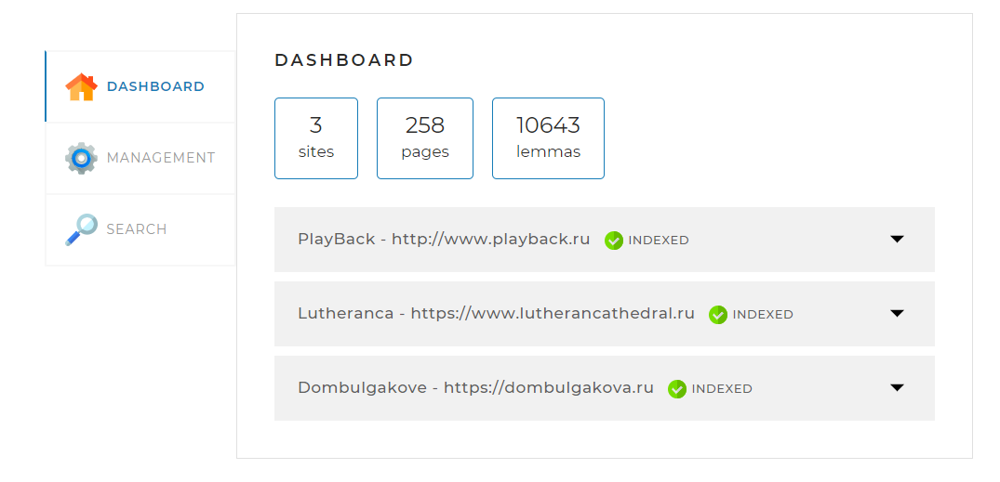
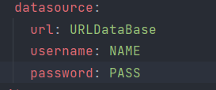
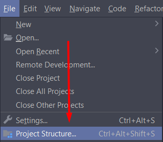
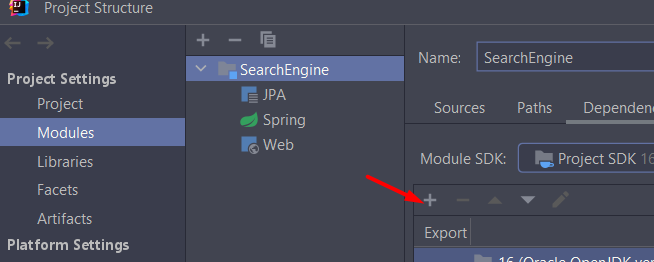
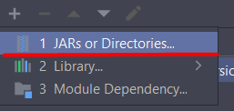
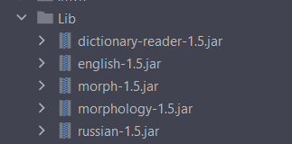
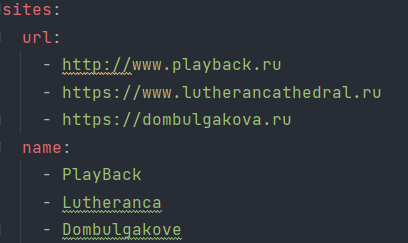

# Search Engine

This project it is simple search engine where you can search different information,
start and stop indexing, add/update sites and t.c.
### The main page that you will see when you start the program

### How to use
#### Database = MySQL
You must change some parameters in application.yml, which you can see in the picture.

And you can connect lib

#### Connect all this jar files

According to the standard, access to the search engine via a link "http://localhost:8080"

If you want changes sites or add new, you can replace these parameters in application.yml

### Technology stack
This project uses technologies such as: SpringBoot , SpringData , JSON , JSOUP ,
MultiThreading , Hibernate , Lemmatizer , Maven , StreamAPI, REST API.

